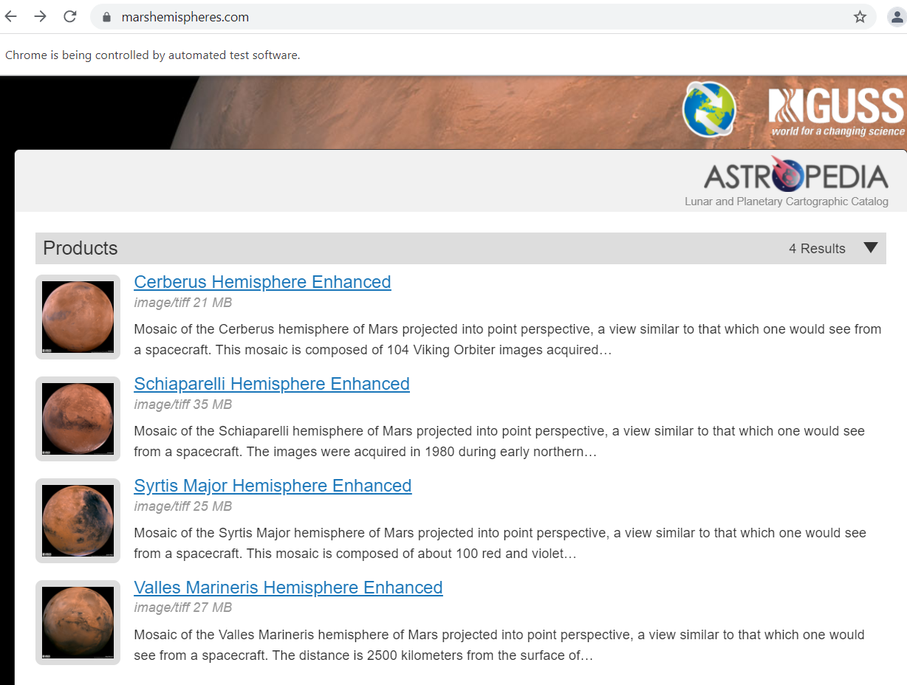
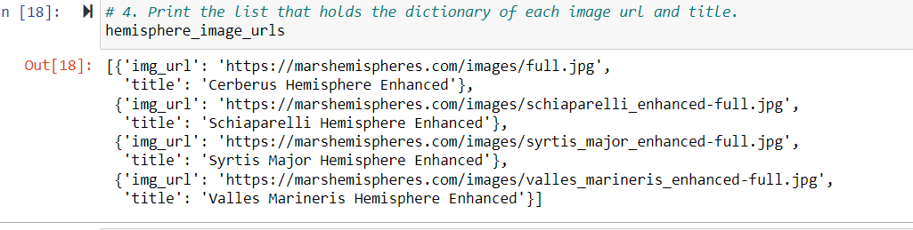

# Overview of the analysis: Explain the purpose of this analysis.
       Mar's hemispheres online site is being reviewed as it is scraping-friendly and enhancement is to be made to include 
all four of the hemisphere images. We will use BeautifulSoup and Splinter to scrape full-resolution images of Mars’s hemispheres and the titles of those images, store the scraped data on a Mongo database, use a web application to display the data, and alter the design of the web app to accommodate these images.

# Results: 

  ## Deliverable 1
     1-Code is written that retrieves the full-resolution image and title for each hemisphere image 
     2-The full-resolution images of the hemispheres are added to the dictionary
     3-The titles for the hemisphere images are added to the dictionary
     4-The list contains the dictionary of the full-resolution image URL string and title for each hemisphere image

    
 
 
 
     
  ## Deliverable 2
     1-The scraping.py file contains code that retrieves the full-resolution image URL and title for each hemisphere image
     2-The Mongo database is updated to contain the full-resolution image URL and title for each hemisphere image  
     3-Index.html file contains code that will display the full-resolution image URL and title for each hemisphere image  
     4-After the scraping has been completed, the web app contains all the information from this module and the full-resolution images and titles for the four hemisphere images 

 
 
 
 
 

  ## Deliverable 3

     The webpage is mobile-responsive
     Two additional Bootstrap 3 components are used to style the webpage

   
   
   
   
   
   
   
